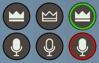

# SkyrimNet Status Widget

Customizable SkyUI HUD widgets that display real-time status information for [SkyrimNet](https://github.com/MinLL/SkyrimNet-GamePlugin), including whisper mode, recording indicators, GameMaster mode, and continuous scene mode.
<h6 align="center">Left: GameMaster enabled | Center: GameMaster disabled | Right: Continuous mode enabled</h6>

  

<h6 align="center">Left: Whisper mode disabled | Center: Whisper mode enabled | Right: Recording indicator</h6>

## Features

### Two Widgets
- **Whisper Widget**: Displays whisper mode and voice recording status
- **GM Widget**: Shows GameMaster mode and continuous scene mode status

### Status Indicators
- **Whisper Mode**: Shows whether whisper mode is active (filled mic = off, hollow mic = on)
- **Recording Indicator**: Displays when voice recording is active (open mic or push-to-talk)
- **GameMaster Mode**: Indicates when the GM agent is enabled
- **Continuous Mode**: Shows when continuous scene mode is active (NPCs keep talking autonomously)

### Customization Options
- **Positioning**: Choose from 9 presets (Top Left/Center/Right, Center Left/Center/Right, Bottom Left/Center/Right) or custom positioning
- **Relative Positioning**: GM widget can be positioned relative to whisper widget (auto-adjusts for top-anchored positions)
- **Size**: Adjustable from 50% to 200%
- **Opacity**: Control transparency from 0% (invisible) to 100% (fully opaque)
- **Auto-hide**: Optionally hide widgets when inactive
- **Only Show When Continuous**: GM widget can be set to only appear when continuous mode is active
- **Global AI Detection**: Widgets automatically hide when SkyrimNet's global AI is disabled

### Update Modes
- **Hotkey Mode** (Default): Event-driven updates triggered by hotkey presses with brief polling on load (zero continuous background polling)
- **Polling Mode**: Periodically checks status with configurable interval (0.1-1.0 seconds)

## Requirements

- [SkyUI](https://www.nexusmods.com/skyrimspecialedition/mods/12604)
- [SkyrimNet](https://github.com/MinLL/SkyrimNet-GamePlugin)

## Installation

1. Install all requirements and their requirements
2. Install this mod with your mod manager

## Configuration (MCM)

Access the mod MCM (SkyrimNet Status Widget) to customize both widgets. Three pages are available: Settings, Whisper Widget, and GM Widget.

### Settings Page
- **Hide All Widgets**: Master toggle to hide both widgets
- **Use Hotkey Mode**: Enable event-driven updates (default, zero continuous polling)
- **Poll Interval**: How often to check status in polling mode (0.1-1.0 seconds)
- **Refresh**: Force immediate update of both widgets
- **Global AI Status**: Displays current SkyrimNet AI state (ON/OFF)

### Whisper Widget Settings
- **Show Widget**: Toggle whisper widget visibility
- **Size**: Scale the widget (50-200%)
- **Opacity**: Adjust transparency (0-100%)
- **Show Recording Indicator**: Toggle recording state display
- **Hide When Inactive**: Auto-hide when not in whisper mode and not recording
- **Position Preset**: Quick position presets (9 options plus User Defined)
- **X/Y Position**: Manual positioning
- **Horizontal/Vertical Anchor**: Anchor widget to screen edges

### GM Widget Settings
- **Show Widget**: Toggle GM widget visibility
- **Size**: Scale the widget (50-200%)
- **Opacity**: Adjust transparency (0-100%)
- **Show Continuous Mode Indicator**: Toggle continuous mode indicator
- **Hide When Inactive**: Auto-hide when GM is disabled
- **Only Show When Continuous**: Only show widget when continuous mode is active
- **Relative to Whisper Widget**: Position GM widget relative to whisper widget (auto-inverts Y offset for top-anchored positions)
- **Relative X/Y Offset**: Offset from whisper widget when relative positioning is enabled
- **Position Preset**: Quick position presets (9 options plus User Defined)
- **X/Y Position**: Manual positioning
- **Horizontal/Vertical Anchor**: Anchor widget to screen edges

## Known Limitations

- Hotkey mode requires reload to update keybind changes
- Recording indicator may briefly show incorrect state in rare edge cases (updates quickly via burst polling)
- Custom SKSE menus may not trigger menu close handler for state sync

## Credits

Special thanks to:
- SkyrimNet development team
- SkyUI team
